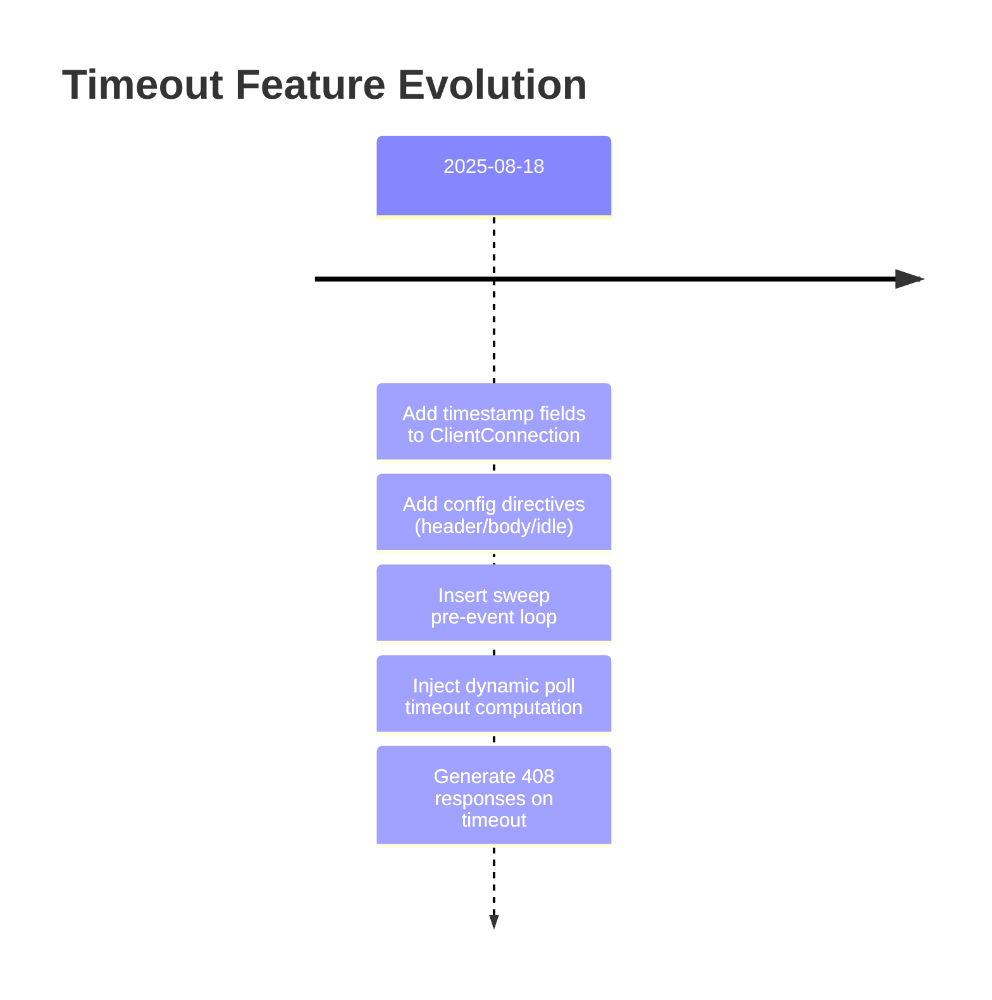
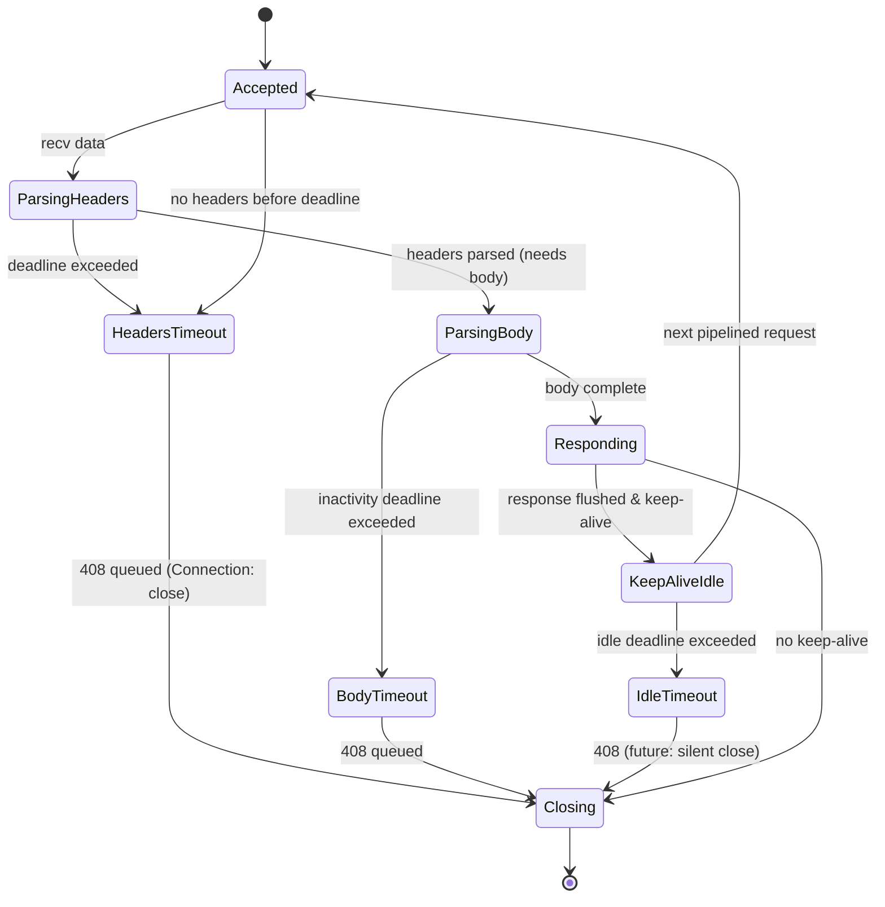
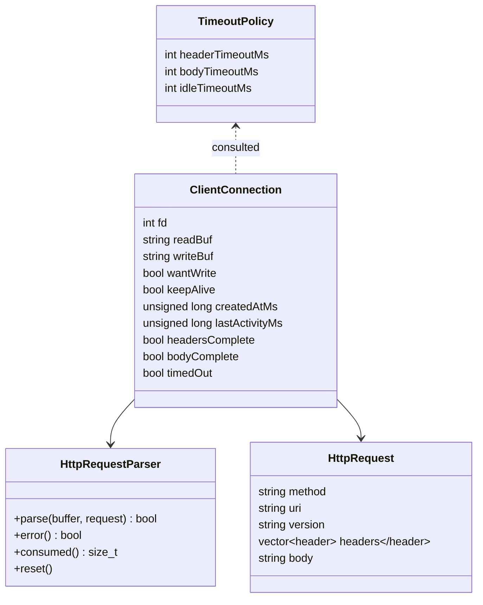

# ADR 0001: Core Architecture and Timeout Handling

## Status

Accepted

## Context

We are implementing an HTTP/1.1 server (`webserv`) in strict C++98 for the 42 School project. Architectural constraints:

- Single-threaded, non-blocking I/O using `poll()` only (one poll loop for all FDs).
- Must support GET, POST, DELETE, file uploads, directory listing, CGI (future), chunked transfer, persistent connections.
- Configuration-driven (NGINX-inspired) with per-server and per-route directives.
- Resource safety via manual RAII (no exceptions) and bounded client impact (timeouts & body size limits).

Recent evolution introduced connection lifecycle timeouts (header, body, idle) to prevent resource starvation and hung sockets. We now integrate dynamic poll timeout derivation and graceful 408 responses for timed-out request assembly.

## Decision

Adopt a stateful per-connection struct (`ClientConnection`) tracking:

- Buffers (read/write), parser, request object.
- Lifecycle timestamps: `createdAtMs`, `lastActivityMs`.
- Progress flags: `headersComplete`, `bodyComplete`.
- Policy flags: `keepAlive` (+ future `timedOut`).

Implement timeout classes:

1. Header timeout: time from accept until headers parsed.
2. Body timeout: inactivity while awaiting full message body.
3. Idle timeout: keep-alive quiescent period after full response.

Event loop additions:

- Before each poll cycle: sweep connections; enqueue 408 response (Request Timeout) for header/body deadline breach; mark keep-alive false. Idle timeout likewise forces closure after flush (currently also emits 408; may refine later).
- Dynamic poll timeout = minimum remaining ms among all active deadlines (header/body/idle) to avoid coarse fixed sleep.

Response strategy:

- If no data queued and timeout occurs pre-response, synthesize minimal 408 with `Connection: close`.
- Non-chunked simple bodies for predictability; no attempt to salvage partial requests.

Simplifications / trade-offs:

- Uses `time()` (1s granularity) instead of `gettimeofday`; acceptable early, upgrade path documented.
- Applies first server block's timeout values to all connections pending per-host abstraction.
- Idle timeout currently also mapped to 408 (spec nuance left for later refinement).

## Alternatives Considered

| Alternative                                     | Rationale for Rejection                                                                           |
| ----------------------------------------------- | ------------------------------------------------------------------------------------------------- |
| Per-FD timerfd / OS timers                      | Adds platform complexity (kqueue/epoll divergences) conflicting with portable poll-based mandate. |
| Single global fixed poll timeout                | Risks delayed reaction to earliest deadline or excess wakeups when large.                         |
| Closing sockets silently on header/body timeout | Reduces observability for clients; 408 provides clearer semantic signal.                          |
| Exception-based error paths                     | Violates C++98 + project constraints (no exceptions).                                             |

## Consequences

Positive:

- Prevents unbounded FD occupation by slowloris-style clients.
- Reduces latency to detect expired connections via adaptive poll timeout.
- Clearer debugging (stderr `[timeout] fd=...` + 408 emission).

Negative / Debt:

- Coarse 1s timing can over-wait up to ~999ms.
- 408 for idle keep-alive may be spec-ambiguous (should likely be silent close); needs follow-up.
- Uniform timeout policy ignores virtual host overrides (future config extension).
- `timedOut` field unused presently (placeholder).

## Risks & Mitigations

- Risk: Starvation if sweep only after long poll wait. Mitigated by dynamic timeout shrinking poll wait toward earliest deadline.
- Risk: Large bodies partially uploaded then timeout → wasted I/O. Acceptable; could add progressive flushing or 100-continue gating later.
- Risk: Unclear differentiation between timeout types. Future: distinct logging tags + different status (e.g., idle just close).

## Future Work

- Replace `time()` with millisecond clock.
- Per-virtual-host timeout selection post Host header parse.
- Distinguish idle close vs 408; send 408 only for request (header/body) timeouts.
- Integrate CGI execution with same timeout primitives (script exec / read pipes).
- Implement streaming/chunked responses leveraging same activity timestamp updates.
- Utilize `timedOut` flag for metrics and adaptive throttling.

## Timeline of Incremental Changes (Simplified)



## Component Interaction Overview

```mermaid
flowchart TD
  A[Accept Loop] -->|new fd| B[ClientConnection]
  B --> R[HttpRequestParser]
  R -->|on complete headers/body| L[Lifecycle Flags]
  L --> T[Timeout Evaluator]
  T -->|deadline calc| P[Poll Timeout]
  P --> E[Poll()]
  E -->|events| H[Handlers]
  H -->|activity| U[Update lastActivityMs]
  T -->|breach| Q[Queue 408 Response]
  Q --> W[Write Flush]
  W -->|done & keepAlive? no| X[Close FD]
```

## Connection State Progression



## Data Model (Simplified)



## Rationale Summary

This design layers timeout awareness orthogonally to request parsing without introducing additional system primitives (e.g., timerfd), preserving portability and simplicity while mitigating common slow client resource exhaustion vectors.

## References

- RFC 2616 Sections 4, 8 (message framing & connections) – baseline semantics.
- 42 Webserv subject (timeout & single poll loop constraints).
- Google C++ Style Guide (struct layout, forward declarations).
