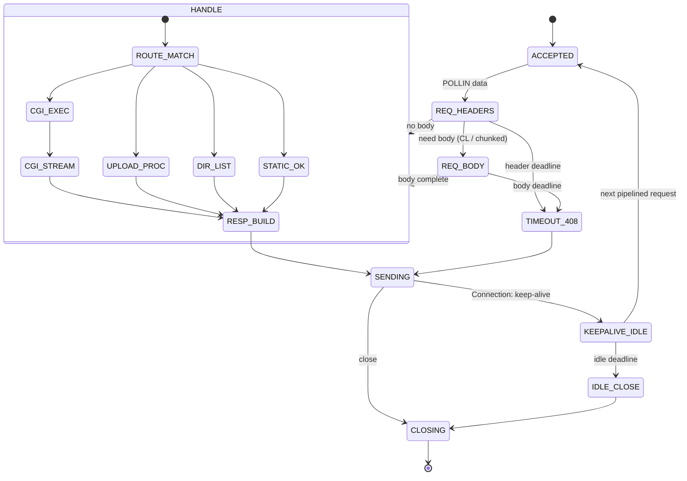
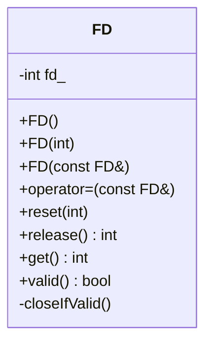
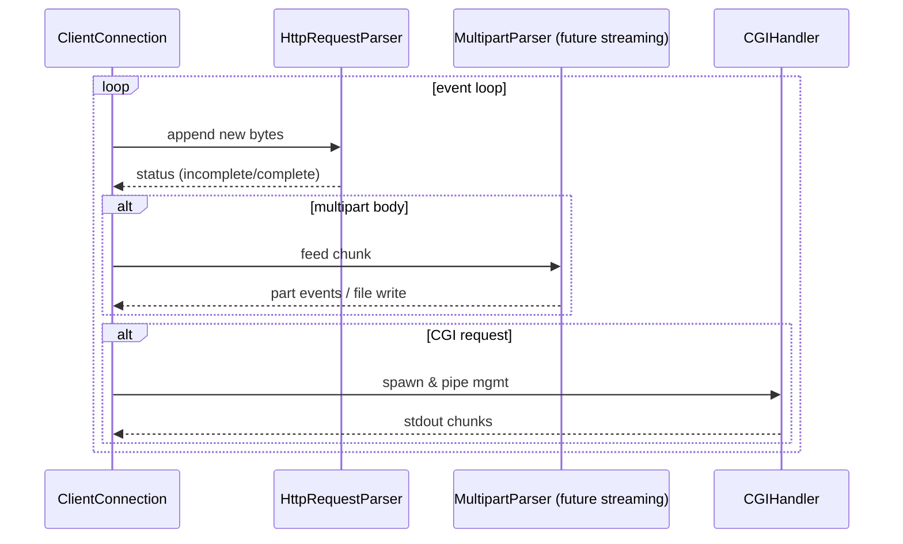

# ADR 0002: Comprehensive Architectural Blueprint

## Status

Proposed

## Context

A detailed narrative blueprint describing the architectural pillars (event-driven poll loop, stateful connection management, RAII resource safety, config‑driven routing, streaming parsers for HTTP, multipart, and CGI) was authored. We need to formalize which elements are part of the committed baseline versus future enhancements, and represent key flows visually for maintainers.

## Decision

Adopt the described event-driven, single-threaded poll() architecture with explicit per-connection state machines and layered parsers as the canonical baseline. Defer some advanced behaviors (full CGI, streaming multipart to disk, full error taxonomy) to staged milestones.

## Architecture Overview (Visual Summary)

```mermaid
flowchart LR
  subgraph EV[Event Loop]
    P[poll()] --> D{dispatch}
  end
  L[Listening Sockets] -->|accept| CC[ClientConnection]
  D --> RCV[Readable?]
  D --> SND[Writable?]
  RCV --> PARSE[HTTP Parser]
  PARSE -->|headers done| ROUTE[Router]
  ROUTE --> HANDLERS{Handler}
  HANDLERS --> STATIC[Static File]
  HANDLERS --> DIR[Dir Listing]
  HANDLERS --> UPLOAD[Upload / Multipart]
  HANDLERS --> CGI[CGI Exec]
  STATIC --> RESP
  DIR --> RESP
  UPLOAD --> RESP
  CGI --> RESP
  RESP[Build Response] --> BUF[Write Buffer]
  SND --> BUF --> SEND[send() slices]
  subgraph TIMEOUTS
    CC --> TM[Deadline Calc]
    TM --> P
  end
```

## Connection State Machine (Current & Future States)



## RAII Resource Wrappers

Current: `FD` (dup-on-copy, close in dtor). Future: add NonCopyFD (move-like semantics emulated) for uniqueness-critical pipes & CGI FDs.



## Parsing Layers



## Staging & Milestones

| Milestone | Scope                                                                        | Exit Criteria                                             |
| --------- | ---------------------------------------------------------------------------- | --------------------------------------------------------- |
| M1        | Core poll loop, basic HTTP, static files, keep-alive, timeouts               | Pass manual curl/browser tests; no leaks under valgrind   |
| M2        | Robust request parser (chunked), directory listing, DELETE, uploads (raw)    | All existing tests + new parser unit tests green          |
| M3        | Streaming multipart parser to disk                                           | Large file upload (>10MB) without OOM; integrity verified |
| M4        | CGI execution (blocking isolation via fork + pipes), response header parsing | Dynamic script returns 200/302 reliably                   |
| M5        | Enhanced routing: virtual hosts, error pages, redirects                      | Config test matrix passes                                 |
| M6        | Hardened security: canonical path, traversal prevention, size limits         | Security test suite passes                                |

## Rationale

The blueprint balances simplicity (single thread, poll) with correctness (state machines, RAII) and extensibility (layered handlers). Deferring CGI & streaming multipart reduces early complexity while establishing invariant-rich foundations.

## Consequences

- Positive: Predictable resource use, ease of reasoning, minimal synchronization complexity.
- Neutral: Single core utilization (acceptable for pedagogy / scope).
- Negative: Requires meticulous state bookkeeping; potential latency variance due to poll granularity (mitigated by dynamic timeout selection).

## References

See narrative blueprint and ADR 0001 for detailed citations.

## Notes

This ADR supersedes ad-hoc architectural descriptions; future ADRs must reference this when altering event loop, connection lifecycle, or parser layering.
